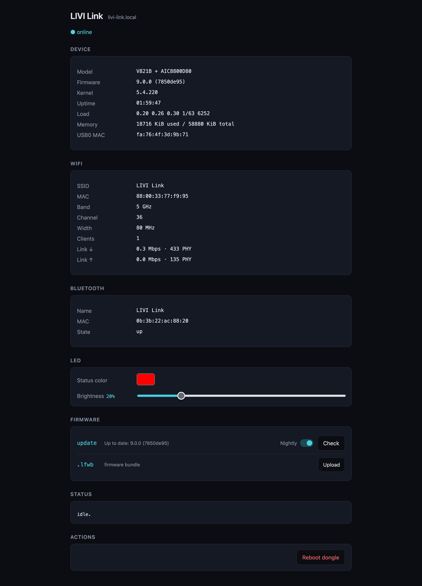

# LIVI Link

A CarPlay dongle reflashed into a network attached accessory for LIVI's native CarPlay stack.
It works on Linux and on macOS and carries three things, each of them picked separately in the
settings:

- **MFi authentication**, the coprocessor CarPlay needs, reachable over the network
- **A Wi-Fi access point**, selectable as the Wi-Fi interface for wireless sessions
- **Bluetooth**, selectable as the Bluetooth adapter on Linux. On macOS the dongle pairs with the
  phone itself and passes the session on to LIVI

A Mac has no I²C bus to put a coprocessor on, so there this is the only route to CarPlay besides BAA. On Linux
it is an alternative to a chip on the board, and a way to add an access point and a Bluetooth
adapter to a machine that has neither. LIVI switches the dongle's access point off while it is not
chosen in the settings, to reduce interference.

The iPhone plugs into the host. The dongle's own OTG port works on macOS only.

## Supported hardware

Many dongles are the same board under a different name and ship the same stock firmware. A row
is only **confirmed** once someone has installed LIVI Link on that exact product.

| Target | Hardware | Sold as | Wi-Fi | State |
| --- | --- | --- | --- | --- |
| `cpc200-ccpa` | i.MX6, IW416 (A15W board) | CPC200-CCPA | 5 GHz, 40 MHz | confirmed |
| `v821b_aic8800d80` | Allwinner V821B, AIC8800D80 | Mini Ultra3 | 5 GHz, 80 MHz | confirmed |
| `v821b_aic8800d80` | Allwinner V821B, AIC8800D80 | CPC200-C2Air | 5 GHz, 80 MHz | not confirmed |

The target is the name the firmware is published under.

On the CPC200-CCPA the install has been reported to fail from stock firmware `2025.10.15.1127`,
where the dongle drops off USB before anything is written, and to work after a downgrade to
`2025.02.25.1521` ([#341](https://github.com/f-io/LIVI/issues/341),
[#347](https://github.com/f-io/LIVI/issues/347)). This could not be reproduced here: a dongle on
the latest stock firmware installed fine. If yours drops off USB during the install, a downgrade
is worth a try.

## Setup

Flashing a dongle is at your own risk. If it goes wrong, open an
[issue](https://github.com/f-io/LIVI/issues): most dongles can be recovered even after a failed
flash.

Download `livi-link-provision` for your platform from the release page, then with the dongle
plugged in:

```bash
chmod +x livi-link-provision
./livi-link-provision
```

macOS quarantines downloads, so there run this first:

```bash
xattr -d com.apple.quarantine livi-link-provision
```

If the dongle is still stock the tool asks you to unplug and replug it once, then runs
on its own: backup, install, reboot, verify. The backup is taken before anything changes, under
`~/Library/Application Support/LIVI/dongle-backup/` (macOS) or `~/.local/share/LIVI/dongle-backup/`
(Linux).


## Web interface

<http://livi-link.local/>, or <http://10.10.10.1/> over USB. It shows the firmware the dongle
runs, the access point as the radio really runs it (channel, width, clients, link rate),
Bluetooth, and the LED colour and brightness where the dongle's LED can do colours.

<p align="center">
  
</p>

## Updating

Under **Firmware**, **Check** looks for newer firmware, from the latest release or from the
nightly when **Nightly** is on, and **Update** installs it. The device showing the web interface
needs internet access for this. The LED alternates red and blue while the dongle writes, do not
unplug until it stops.

The firmware files are attached to every release and can be uploaded by hand instead.

## LED

Where a dongle has an LED, Wi-Fi shows on the status LED[^led] and Bluetooth in blue.

| State | LED |
| --- | --- |
| Waiting for a Wi-Fi client | status LED blinks |
| Wi-Fi client connected | status LED on |
| Bluetooth paging | blue blinks |
| Bluetooth connected | blue on |
| Writing firmware | red and blue alternate |

[^led]: Red, or cyan where the LED can do colours, with colour and brightness customizable on
    the web interface.

## Getting back to stock

Upload the backup from the install on the web interface under **Firmware**. The dongle writes it
and reboots into its original firmware. The LED alternates red and blue while it writes, do not
unplug until it stops.

## If something goes wrong

If the dongle does not come up on USB or Wi-Fi, give it 30 seconds, then replug it. The logs are under `/tmp` on the dongle.

## Firmware

The firmware carries LIVI's version and the commit it was built from, `9.0.0 (7850de95)`. Both
are shown as **Firmware** on the web interface.
